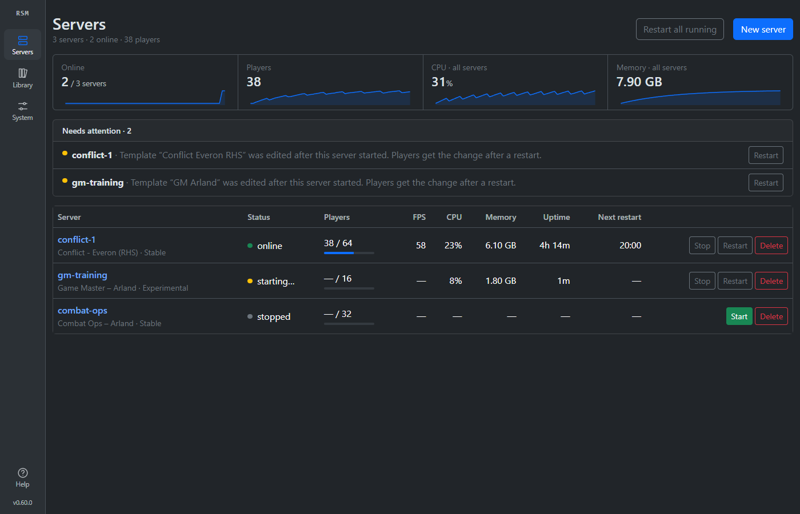
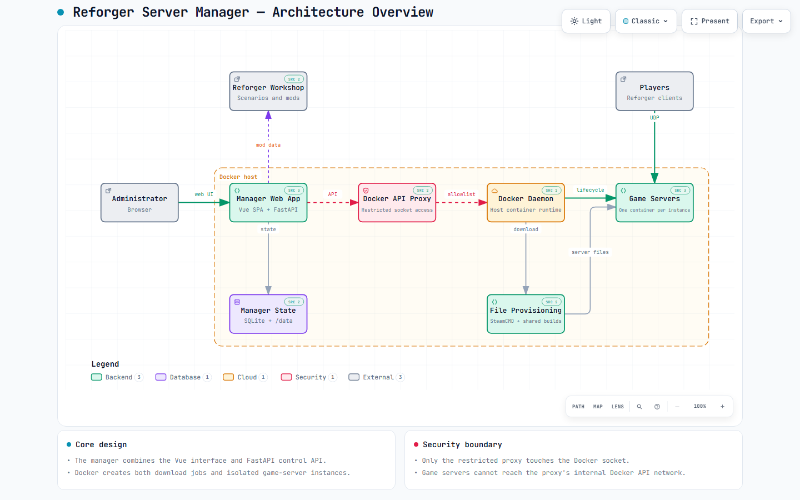

# Reforger Server Manager

A web-based manager for running one or more [Arma Reforger Dedicated Servers](https://community.bistudio.com/wiki/Arma_Reforger:Server_Hosting) with Docker. Create reusable templates, manage scenarios and Workshop mods, download server files with SteamCMD, and operate every server from one browser UI.

It runs on Linux, a public VPS, or Windows 10/11 through Docker Desktop. The project is stable and feature-complete; current work focuses on maintenance, compatibility, and fixes.

**Container image:** `ghcr.io/tubalainen/reforger-server-manager:latest`

[Installation](docs/installation.md) · [Feature tour](docs/features.md) · [Releases](https://github.com/tubalainen/reforger-server-manager/releases) · [Video walkthrough](https://youtu.be/s6ml4SacnRo)



## Highlights

- Run multiple isolated stable or experimental servers.
- Build reusable templates for scenarios, mods, admins, bans, whitelist, and server settings.
- Search the Workshop, resolve dependencies, lock versions, and control mod order.
- Download and update server files through SteamCMD with live progress.
- Start, stop, restart, monitor, and inspect live logs from the browser.
- Schedule restarts and optionally update or restart servers when new builds are detected.
- Back up and restore every server template and mod list as one file.
- Back up, download and restore each server's saved world, including one written under a template the server no longer runs — or force a combination the manager would refuse.
- Import or export `config.json` while preserving settings the UI does not know about.
- Keep Docker access behind a least-privilege socket proxy; managed containers run with `no-new-privileges`.

See the [feature tour](docs/features.md) for screenshots and the complete capability list.

## Quick start

Choose the setup that matches where the manager will run. The installers generate credentials and start the stack; detailed prerequisites, networking, security, updates, and uninstall instructions are in the [installation guide](docs/installation.md).

| Platform | Install | Open |
|---|---|---|
| Linux at home or on a LAN | `curl -fsSL https://raw.githubusercontent.com/tubalainen/reforger-server-manager/main/scripts/linux/install-local.sh \| sudo sh` | `http://localhost:7780` |
| Linux VPS with a domain | `curl -fsSL https://raw.githubusercontent.com/tubalainen/reforger-server-manager/main/scripts/linux/install-vps.sh \| sudo sh` | `https://your-domain` |
| Windows 10/11 | Run the commands below in PowerShell | `http://localhost:7780` |

```powershell
$installer = "$env:TEMP\reforger-install.ps1"
Invoke-WebRequest -UseBasicParsing https://raw.githubusercontent.com/tubalainen/reforger-server-manager/main/scripts/windows/install.ps1 -OutFile $installer
powershell -ExecutionPolicy Bypass -File $installer
```

> [!IMPORTANT]
> The GUI can control Docker containers and should be treated like host-level access. Use a strong password, never expose port `7780` directly to the internet, and use HTTPS for remote access. The VPS installer configures HTTPS through Caddy.

Players connect through UDP game ports, not the web UI. The default ranges are `2001-2020` and `17777-17796`; forward only the ports assigned to your servers. Never forward the GUI or RCON ports. See [Networking and firewalls](docs/installation.md#networking-and-firewalls).

### First run

After signing in:

1. Pull the server runtime image under **System › Server files**.
2. Download the stable or experimental server files on the same page.
3. Create a template under **Library**, then create and start a server from it under **Servers**.

The default server runtime is the [ACE Mod-compatible image](https://github.com/acemod/reforger), configurable with `REFORGER_SERVER_IMAGE`.

## Architecture

[](https://tubalainen.github.io/reforger-server-manager/architecture/reforger-server-manager-overview.html)

The browser talks to a FastAPI manager backed by SQLite. The manager delegates narrowly scoped container operations to a Docker socket proxy, while SteamCMD downloads and each Arma server run in separate containers. Persistent data, server files, profiles, and Workshop content live in shared volumes or bind mounts.

Click the image for the interactive, animated overview, or edit the [Archify specification](docs/architecture/reforger-server-manager-overview.architecture.json).

## Documentation

- [Installation, security, networking, and updates](docs/installation.md)
- [Features and screenshots](docs/features.md)
- [Interactive architecture overview](https://tubalainen.github.io/reforger-server-manager/architecture/reforger-server-manager-overview.html)
- [Release notes](https://github.com/tubalainen/reforger-server-manager/releases)

## Development

Build and run the complete stack:

```bash
docker compose up --build -d
```

Run backend tests in the image:

```bash
docker build --target test .
```

Run the frontend development server:

```bash
cd frontend
npm install
npm run dev
```

## Credits and disclaimer

Inspired by [Longbow](https://github.com/ArmaTools/longbow). The project uses [steamcmd](https://developer.valvesoftware.com/wiki/SteamCMD), Bohemia Interactive's public Workshop and server APIs, and can run community server images such as [ACE Mod's image](https://github.com/acemod/reforger) and [RouHim's image](https://github.com/RouHim/arma-reforger). See [Bohemia's server hosting documentation](https://community.bistudio.com/wiki/Arma_Reforger:Server_Hosting) for the underlying platform.

This application was fully developed using Claude AI. It is provided without warranty; review the configuration and scripts before using it on a public host. Arma Reforger is a trademark of Bohemia Interactive. This project is not affiliated with or endorsed by Bohemia Interactive.

## License

[MIT](LICENSE)
