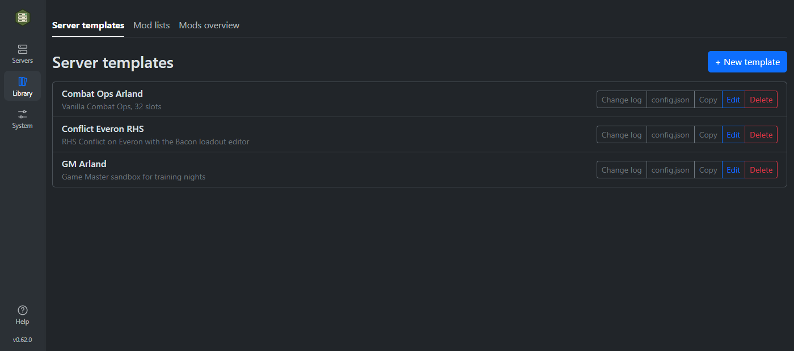
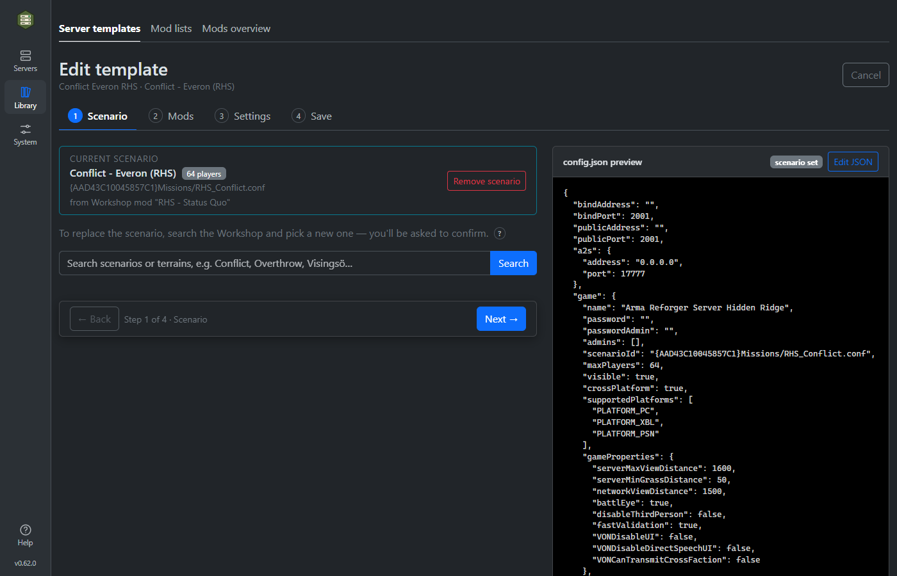
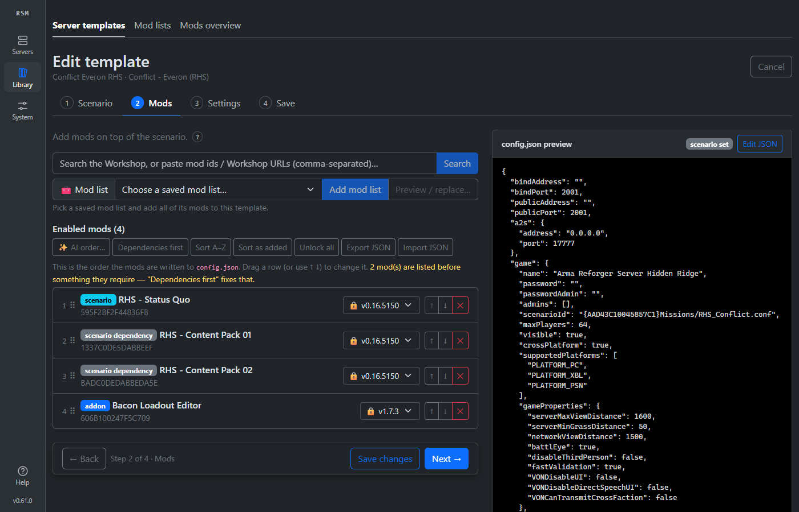
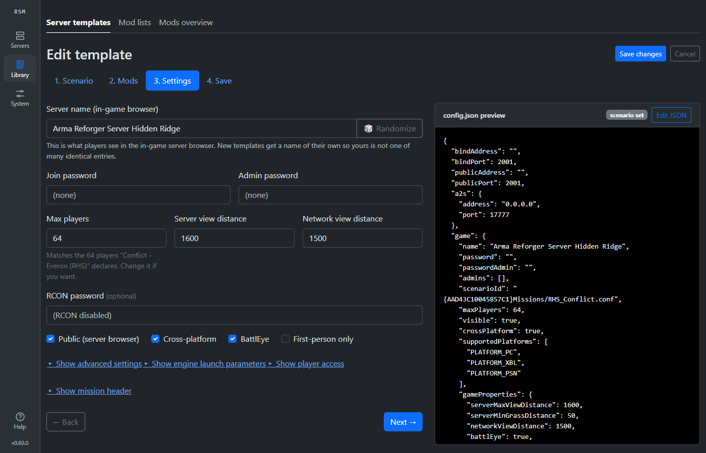
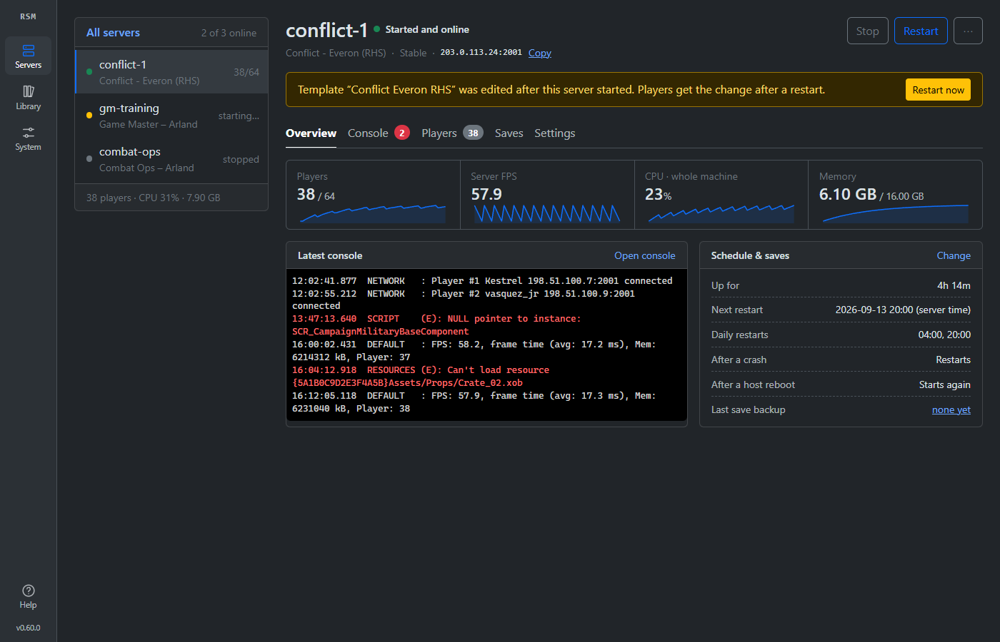

# Reforger Server Manager

A web-based manager for **Arma Reforger Dedicated Servers**. Draw up server templates
(scenario, mods, settings) in an intuitive web GUI, download the server files with
SteamCMD at the click of a button, and run any number of server instances — each in its
own Docker container — from a single `docker-compose.yaml`.

Runs on **Linux** (any VPS or home box) and on **Windows 10/11** via Docker Desktop,
where a PowerShell installer sets everything up and puts a start shortcut on your
Desktop. See [Getting started](#getting-started) or
[Running on Windows](#running-on-windows-11--10).

Inspired by (and a spiritual successor to) [Longbow / ArmaReforgerServerTool](https://github.com/soda3x/ArmaReforgerServerTool)
by soda3x — reimagined as a Dockerized web application.

> **Status: stable and feature-complete for day-to-day hosting.** Everything below is
> built and released: templates and the mod manager, SteamCMD downloads, multiple live
> server instances with logs, stats, scheduled restarts and crash recovery. Development
> continues in the open — see the [issues](https://github.com/tubalainen/reforger-server-manager/issues)
> and [releases](https://github.com/tubalainen/reforger-server-manager/releases).

Docker image: `ghcr.io/tubalainen/reforger-server-manager:latest`

## Screenshots

<p align="center">
  <br>
  <em>The template library — each template bundles a scenario, its mods and every server
  setting. Edit one, download its <code>config.json</code>, or delete it.</em>
</p>

<p align="center">
  <br>
  <em>Editing a template: pick a scenario straight from the Workshop, with a live
  <code>config.json</code> preview beside every step.</em>
</p>

<p align="center">
  <br>
  <em>The mod manager: enable mods on top of the scenario — dependencies are pulled in and
  labelled automatically, and any mod can be locked to a specific version.</em>
</p>

<p align="center">
  <br>
  <em>Every server setting in one place — player limit, view distances, VON, persistence,
  RCON and the full set of engine launch parameters.</em>
</p>

<p align="center">
  <br>
  <em>The Server Instances page: a live status bar and per-instance controls (start/stop,
  restart, logs) up top, and one-click SteamCMD server-file downloads and the runtime-image
  pull below.</em>
</p>

## Features

- [x] Single `docker-compose.yaml` + single `.env` deployment, built-in login
- [x] One-click SteamCMD download of server files — **Stable** (app `1874900`) or
      **Experimental** (app `1890870`) — with live progress bars and streaming logs
- [x] Server templates: pick a scenario straight from the
      [Workshop](https://reforger.armaplatform.com/workshop), auto-resolve all mod
      dependencies, add extra mods, tune settings, save — and download the resulting
      `config.json`; or **upload an existing `config.json`** to pre-fill the wizard;
      the wizard shows the currently selected scenario and asks before a
      replace/remove drops the mods it brought in
- [x] Mod manager: search or paste-by-id to enable mods on top of a scenario —
      dependencies (and sub-dependencies) follow automatically; disabling a mod prompts
      whether to drop the dependencies it brought in; reorder mods and export/import the
      mod list as JSON; mods follow the latest Workshop release by default, or **lock any
      mod to a specific version** (only locked versions are written to `config.json`)
- [x] **Max players follows the scenario** — the wizard seeds the player limit from the
      count the scenario declares on the Workshop (a 12-player co-op scenario no longer
      gets a 64-slot server), and you can override it whenever you like
- [x] **Edit `config.json` by hand** — the preview panel flips into a real JSON editor
      (syntax highlighting, line numbers, indent guides, live error marks). Keys the GUI
      knows flow back into the wizard's fields; **any key it doesn't know — including
      scenario-specific `gameProperties` — is kept and re-applied on every future save**.
      Validation blocks broken JSON and out-of-range values, but never blocks a custom key
- [x] **Mods Overview** — one persistent list of every mod ever baked into a template, shown
      as a tree with its live-resolved dependencies. Each mod is highlighted where it's baked
      &amp; downloaded to a server (with version); a mod stays on the list even after its
      template is gone. Tick mods at any level and **add them to a template in one click**;
      pin mods as **persist** so a prune never removes them, and **Clear &amp; rescan** to
      drop the ones no template uses any more
- [x] **Per-template change log** — every template keeps a searchable, tamper-proof history
      of what changed and when: mods added/removed and version locks, scenario changes, and
      each setting edit (old → new), timestamped in your server's timezone. Read-only — it
      can't be altered or deleted, and is removed only with the template
- [x] Multiple concurrent server instances (stable + experimental side by side), each a
      Docker container spawned and supervised by the manager
- [x] Live server logs in the browser (with a clear-window button), crash auto-restart
- [x] A **status bar in the top banner** shows every server at a glance — online state and
      player count — from any page, and the instance page flags when a template changed
      since the server started, with a one-click restart to apply it
- [x] **Stored-data controls** per instance: see how much disk the baked mods, saved game
      and logs take, and clear any of them — wiping the baked mods makes the next start
      re-download and re-bake the template's current mod list
- [x] Scheduled restarts — set daily restart times per instance (server local time)
- [x] Live status per instance (players, FPS, CPU, memory) and a **Connect** address that
      auto-detects the server's public IP from its log when `PUBLIC_ADDRESS` isn't set
- [x] Honest server status: an instance reads **starting…** while the game server downloads
      mods and loads the world, and turns **online** only once its log says it is up and
      joinable — not the moment the container starts
- [x] Built-in **User Guide** page: getting-started walkthrough, feature guide, FAQ and
      links to the official Reforger documentation
- [x] **Windows 10/11 support** via Docker Desktop (WSL2): PowerShell installer, Desktop
      start shortcut, and a **Ports & firewall** panel that prints the exact firewall
      command for your configured port ranges

## Architecture

```
 Browser ──► manager container (FastAPI + Vue)
                │  docker.sock
                ├─► steamcmd container (one-shot downloads → shared volumes)
                └─► reforger-instance-* containers (one per server)
```

Only the manager lives in the compose file. Server instances and SteamCMD download jobs
are sibling containers the manager creates through the Docker API, attached to the same
Docker network and labeled so they survive manager restarts. Server files are downloaded
once per branch into local folders (`./serverfiles/stable`, `./serverfiles/experimental`)
and mounted read-only into each instance.

## How server instances run

Each instance is a sibling container created from `REFORGER_SERVER_IMAGE`
(ACE Mod's [arma-reforger](https://github.com/acemod/docker-reforger) image by
default). The manager:

- leases a unique host UDP port for game / A2S / RCON from the `.env` ranges and
  bakes them into a per-instance `config.json` rendered from the template;
- mounts the shared `./serverfiles/<branch>` install at `/reforger` so instances
  of the same branch reuse one download, plus per-instance `configs/`, `profile/`
  and `workshop/` folders under `./data/instances/<id>/`;
- labels the container so it is rediscovered after a manager restart, and
  restarts it automatically if it crashes (toggle per instance).

Stable and experimental servers can run side by side. Live server logs stream to
the instance detail page.

## Getting started

**On Windows?** Skip this section entirely — go to
[Running on Windows](#running-on-windows-11--10), where an installer does all of it for you.

On Linux, two paths, depending on how comfortable you are with Docker.

### New to Docker & Linux? (step-by-step)

**1 — Install Docker** on your Linux server with the official one-line convenience
script:

```bash
curl -fsSL https://get.docker.com | sudo sh
```

Then let your user run Docker without `sudo`, and make sure the service starts on
boot:

```bash
sudo usermod -aG docker "$USER"      # log out and back in for this to take effect
sudo systemctl enable --now docker
```

Verify it works (after logging back in):

```bash
docker run --rm hello-world
```

**2 — Run this application.** You don't need the source code — just a folder with
the `docker-compose.yaml` and a `.env` file. Create a folder and download both:

```bash
mkdir reforger-server-manager && cd reforger-server-manager

# grab the compose file and an example .env into this folder
curl -fsSLO https://raw.githubusercontent.com/tubalainen/reforger-server-manager/main/docker-compose.yaml
curl -fsSL  https://raw.githubusercontent.com/tubalainen/reforger-server-manager/main/.env.example -o .env

# edit .env: at minimum set ADMIN_PASSWORD and SESSION_SECRET
# (if a username or password contains a '$', write it twice: '$$' — Docker
#  Compose reads a single '$' as a variable and drops it)
nano .env

# pull the published image and start
docker compose pull
docker compose up -d
```

On the server itself, open `http://localhost:7780` and sign in with the credentials
from `.env`. (By default the GUI binds to `127.0.0.1` — see the security note under
[Quick start](#quick-start) before exposing it.)

**3 — Open the ports (NAT / port forwarding):**

For players on the internet to reach your server, you must open/forward ports
through your router (NAT) **and** any firewall on the Linux host, pointing them at
the Linux server's LAN IP:

- **Game port(s):** UDP `2001–2020` (default `GAME_PORT_RANGE`)
- **A2S query port(s):** UDP `17777–17796` (default `A2S_PORT_RANGE`)
- one game + A2S port pair per running server instance

On the Linux host itself, if you run `ufw` (the one-line installer does this for you):

```bash
sudo ufw allow 2001:2020/udp     # game ports     (GAME_PORT_RANGE)
sudo ufw allow 17777:17796/udp   # server browser (A2S_PORT_RANGE)
```

Note `ufw` writes ranges with a colon (`2001:2020`), not the dash used in `.env`.

Also set `PUBLIC_ADDRESS` in `.env` to your server's public IP so it advertises
correctly to the Arma backend. Keep the RCON ports (`19999–20018`) and the web GUI
(`7780`) **private** — do not forward them to the internet; reach the GUI through a
TLS reverse proxy or an SSH tunnel instead.

### Already comfortable with Docker? (quick version)

You only need Docker with the Compose plugin. Head to [Quick start](#quick-start)
below, fill in `.env`, `docker compose up -d`, and forward the UDP game/A2S ports
listed above. Put a TLS reverse proxy in front of the GUI for VPS use.

## One-line install (Linux)

Two installers, one for each Linux scenario. Both check for Docker (offering to
install it), generate a strong GUI password and session secret, set up the firewall
after confirming with you, install an `rsm` management command, and start the stack.

**Local box — home server or LAN:**

```bash
curl -fsSL https://raw.githubusercontent.com/tubalainen/reforger-server-manager/main/scripts/linux/install-local.sh | sudo sh
```

**Public cloud VPS — adds automatic HTTPS:**

```bash
curl -fsSL https://raw.githubusercontent.com/tubalainen/reforger-server-manager/main/scripts/linux/install-vps.sh | sudo sh
```

> **Prefer to read before running as root?** Sensible — do this instead:
> ```bash
> curl -fsSLO https://raw.githubusercontent.com/tubalainen/reforger-server-manager/main/scripts/linux/install-vps.sh
> less install-vps.sh && sudo sh install-vps.sh
> ```

Afterwards, manage everything with the `rsm` command:

```
rsm start | stop | restart | status | logs | update | config | uninstall
```

The installers are safe to re-run: an existing `.env` is never overwritten, and the
firewall step always allows your **current SSH port first** so a remote session cannot
be cut off. On Windows, use the [PowerShell installer](#running-on-windows-11--10) instead.

For what each scenario sets up — and to do it by hand — see
[Quick start](#quick-start) (local) and [Running on a VPS](#running-on-a-vps-public-server-automatic-https).

## Quick start

You only need the `docker-compose.yaml` and a `.env` — not the source. Create a
folder, drop both in, edit `.env`, then pull and start:

```bash
mkdir reforger-server-manager && cd reforger-server-manager
curl -fsSLO https://raw.githubusercontent.com/tubalainen/reforger-server-manager/main/docker-compose.yaml
curl -fsSL  https://raw.githubusercontent.com/tubalainen/reforger-server-manager/main/.env.example -o .env
# edit .env: set ADMIN_PASSWORD and SESSION_SECRET
# (a '$' in a username/password must be doubled to '$$' — Compose eats a single '$')
docker compose pull
docker compose up -d
```

Open `http://localhost:7780` and sign in with the credentials from `.env`.
No other host setup is needed: the `data/` and `serverfiles/` folders are created on
first run, and the container fixes their ownership itself before dropping privileges
to an unprivileged user (uid 1000).

By default the GUI binds to `127.0.0.1` — put a reverse proxy (nginx/Caddy) with TLS in
front for VPS use, or set `WEB_BIND=0.0.0.0` at your own risk (login is still required).

Several people can use the GUI at once: lists refresh every few seconds, and editing a
server template locks it against the other sessions until that editor leaves (stuck
locks expire on their own, or use **Clear edit locks** on the Templates page). This
works over plain HTTP polling, so no extra nginx/Cloudflare-tunnel configuration is
needed — only the live server-log and download-progress views use WebSockets, which
both pass through by default.

> **Security note:** managing containers means talking to the host Docker daemon, which is
> root-equivalent on the host. The manager does **not** mount `/var/run/docker.sock`
> directly; a bundled least-privilege **docker-socket-proxy** holds the socket and forwards
> only the API calls the manager needs (containers, images, networks, info), denying the
> rest (exec, build, volume create, swarm, secrets, …). This shrinks the attack surface but
> does not remove the daemon's inherent power to create containers — so still treat the web
> GUI credentials as host credentials and never expose the port directly (firewall it, and
> put a TLS reverse proxy in front for remote use).
>
> The built-in login can be turned off with `AUTH_ENABLED=false` so a reverse proxy
> (NGINX, Caddy, Authelia, …) can enforce authentication instead. To do this on an
> exposed deployment you must also set `AUTH_DELEGATED_ACK=true` — your explicit
> confirmation that a proxy in front authenticates every request. Without it, an
> exposed (`WEB_BIND` other than `127.0.0.1`) login-disabled start is **refused**.
>
> As a safety net, when the GUI is bound to a non-loopback address the app also
> **refuses to start** while `ADMIN_PASSWORD` is still the example value (or empty),
> so an exposed box can never come up on `admin` / `change-me-now`. A localhost-only
> bind (the default) keeps a quick local trial frictionless — these are only
> warnings there. When a TLS reverse proxy fronts the GUI (forwarding
> `X-Forwarded-Proto: https`), the session cookie is automatically marked `Secure`.

### First run

Under **Server Instances → Server files** (at the bottom of the Instances page), do both
one-time steps before creating a server instance:

1. **Pull the server runtime image** — the Docker image each instance runs from
   (`REFORGER_SERVER_IMAGE`). `docker compose up` only pulls the manager itself, so the
   runtime image must be fetched once here.
2. **Download the server files** for the branch you want (Stable / Experimental) — the
   ~10 GB of game data mounted into every instance of that branch.

Then head to **Instances** and create your first server from a template.

### Updating (Linux)

Installed with the [one-line installer](#one-line-install-linux)? Just run `rsm update`.

Installed by hand? **Refresh the compose file first, then pull.** A release can change how
the stack is wired — add a service, change a network — and none of that reaches you from an
image pull alone, because the compose file lives in your folder, not in the image:

```bash
cd /path/to/your/install

# 1. refresh the compose file (use docker-compose.vps.yaml if that's what you run)
curl -fsSLO https://raw.githubusercontent.com/tubalainen/reforger-server-manager/main/docker-compose.yaml

# 2. pull the new image and apply
docker compose pull
docker compose up -d --remove-orphans
```

Your `.env` is never touched — it is your configuration. New settings all have safe
defaults, so an existing `.env` keeps working; diff it against the current
[`.env.example`](https://raw.githubusercontent.com/tubalainen/reforger-server-manager/main/.env.example)
if you want to see what a release added.

> `--remove-orphans` is optional but tidy: it clears containers a previous version of the
> compose file defined and this one no longer does. **It cannot touch your game servers** —
> those are sibling containers the manager creates through the Docker API, so they carry no
> Compose project labels and are invisible to it.

> Your servers do restart during the upgrade: replacing the manager container stops every
> running instance, and the ones with **auto-start** enabled come back automatically once it
> is up again. Pick a quiet moment if players are on.

To lock a version rather than follow `latest`, set `MANAGER_VERSION=v0.44.0` in `.env` and
run the same two steps. The Arma **server runtime image** and the **server files** update
separately, from the Downloads panel — see [First run](#first-run).

### Editing `config.json` by hand

The template wizard covers the settings most servers need, but it can't model every key:
`gameProperties` is **scenario-specific**, and mod authors and Bohemia both add keys of
their own. So the `config.json` panel on the right of the wizard has an **Edit JSON**
button that turns it into a full editor — syntax highlighting, line numbers, indent
guides, and errors marked as you type.

When you hit **Apply**, your edit is split in two:

- **Keys the wizard models** are read back into its fields. Change `maxPlayers` in the
  JSON and the Settings step's player limit moves with it.
- **Everything else is kept as a custom key** and re-applied over the config every time
  the template is rendered — so it survives later edits in the wizard, and lands in the
  `config.json` your servers actually run. The panel badges how many a template carries.

Validation is deliberately asymmetric:

| | Behaviour |
|---|---|
| Broken JSON | **Blocked** — marked inline, Apply disabled |
| Missing `game.scenarioId` | **Blocked** — the server would have no mission to load |
| A modelled key out of range (e.g. `maxPlayers: 9999`) | **Blocked** — the server would reject it |
| A key the GUI doesn't recognise | **Allowed**, listed as "kept as-is" |

That last row is the point: an unfamiliar key is usually you configuring your scenario,
not a typo — so it's flagged for visibility and never rejected.

> **Ports are the one exception.** `bindPort`, `publicPort`, `a2s.port` and `rcon.port`
> are assigned per instance from the manager's port ranges, so each server gets its own —
> a value you type for them here is kept in the template but overwritten when an instance
> runs. Set ports on the instance, not in the template's JSON.

## Running on a VPS (public server, automatic HTTPS)

The quick start above binds the GUI to `127.0.0.1`, which is right for a box you sit
in front of. On a rented VPS you want the opposite: reach the GUI from anywhere, over
HTTPS, without ever putting it on the open internet unprotected.

`docker-compose.vps.yaml` does that. **Caddy** terminates TLS and is the only thing
published; the manager gets **no port of its own** and is reachable only through Caddy
on an internal Docker network. Certificates are issued and renewed automatically — there
is no proxy config file to write and no admin panel to secure.

**You need:** a VPS (any 2 GB+ Linux box) and a **domain name** pointed at it. (No domain?
See the [IP-only fallback](#no-domain-yet-ip-only-fallback) below — but read the warning.)

**1 — Point your domain at the VPS.** Create a DNS **A record** for e.g.
`reforger.example.com` → your VPS's public IP. Do this *first*: the certificate is
requested on the very first start, and it can only succeed once the record resolves.

**2 — Install Docker** (skip if your VPS image ships it):

```bash
curl -fsSL https://get.docker.com | sudo sh
```

**3 — Fetch the files and configure:**

```bash
mkdir -p ~/reforger && cd ~/reforger
curl -fsSLO https://raw.githubusercontent.com/tubalainen/reforger-server-manager/main/docker-compose.vps.yaml
curl -fsSL  https://raw.githubusercontent.com/tubalainen/reforger-server-manager/main/.env.example -o .env
nano .env
```

In `.env` set these three, then save:

| Setting | What to put |
|---|---|
| `SITE_ADDRESS` | your domain, e.g. `reforger.example.com` |
| `ADMIN_PASSWORD` | a long, unique password — **these are effectively host-root credentials** |
| `SESSION_SECRET` | output of `openssl rand -hex 32` |

> The manager **refuses to start** on this file while `ADMIN_PASSWORD` is still
> `change-me-now` or empty. That is deliberate: the GUI is internet-facing here, and it
> controls Docker. A `$` in the password must be written twice (`$$`) — Compose eats a
> single one.

**4 — Open the firewall.** Caddy needs 80/443; players need the UDP game ranges. The
GUI itself needs *no* port of its own:

```bash
sudo ufw allow OpenSSH
sudo ufw allow 80,443/tcp        # Caddy (HTTPS + certificate renewal)
sudo ufw allow 2001:2020/udp     # game ports    (GAME_PORT_RANGE)
sudo ufw allow 17777:17796/udp   # server browser (A2S_PORT_RANGE)
sudo ufw enable
```

> **Do not run `ufw enable` without the SSH rule above** — you will lock yourself out
> of the VPS. If your SSH runs on a non-standard port, allow that port instead of
> `OpenSSH`. (The one-line installer detects your live SSH port and always allows it
> first, which is why it is the safer route.)

> **Your VPS provider has a second firewall.** Hetzner Cloud Firewall, AWS security
> groups, Oracle Cloud, Google Cloud and DigitalOcean all filter traffic *before* it
> reaches the machine — and several block almost everything by default, so the `ufw`
> rules above are **not enough on their own**. In your provider's control panel, allow
> inbound **TCP 80, 443** and **UDP 2001–2020, 17777–17796**. If the GUI or your game
> server never becomes reachable despite everything looking right on the host, this is
> almost always the reason.

**5 — Start it:**

```bash
docker compose -f docker-compose.vps.yaml up -d
```

Give it 10–30 seconds to obtain the certificate, then open
**`https://reforger.example.com`** and log in. That's it — continue with
[First run](#first-run) to download the server files.

Watch the certificate being issued (or diagnose a DNS problem) with:

```bash
docker compose -f docker-compose.vps.yaml logs -f caddy
```

### What this setup does for you

- **The GUI is never directly exposed.** The manager publishes no port; only Caddy is
  on the internet. There is no `:7780` to find and no admin panel to leave on defaults.
- **Real HTTPS, automatically.** Including renewal. The session cookie is marked
  `Secure` automatically, because Caddy forwards `X-Forwarded-Proto: https`.
- **The Docker API is fenced off.** The manager talks to the daemon through a
  least-privilege socket proxy on an `internal` network that neither Caddy nor the game
  servers can reach.
- **Live logs work.** Caddy proxies WebSockets natively, so the streaming server log
  and download progress bars work with no extra configuration.
- **Login throttling knows who is who.** `TRUSTED_PROXIES` is preset to Caddy's network, so
  failed logins are rate-limited per real client rather than lumped together — one attacker
  cannot lock you out of your own server.

### No domain yet? (IP-only fallback)

Set `SITE_ADDRESS=:80` and reach the GUI at `http://<your-vps-ip>`.

> **Testing only.** There is no certificate and therefore **no encryption**: your
> password and session cookie cross the internet in clear text, readable by anyone on
> the path. Use it to confirm the stack runs, then get a domain before real use. A
> domain costs a few euros a year and is the only way this is genuinely safe.

## Running on Windows 11 / 10

Windows is supported through **Docker Desktop with its WSL2 backend** — the same
manager image, the same Arma server containers, running inside the lightweight Linux
VM that Docker Desktop manages for you. You never have to touch WSL yourself.

### Install

Open **PowerShell** (a normal window — it asks for admin only when it needs to), then
copy-paste these three lines. They download the installer, then run it:

```powershell
$installer = "$env:TEMP\reforger-install.ps1"
Invoke-WebRequest -UseBasicParsing https://raw.githubusercontent.com/tubalainen/reforger-server-manager/main/scripts/windows/install.ps1 -OutFile $installer
powershell -ExecutionPolicy Bypass -File $installer
```

Append options to the last line if you want them, e.g. `-InstallDir 'D:\Reforger'` or
`-WebPort 8080`.

> **Why not a single `irm … | iex` line?** Because piping a downloaded script straight
> into the interpreter is the *ClickFix* technique that real malware uses, so Microsoft
> Defender blocks it as `Trojan:Win32/ClickFix` — and it would run code you never had a
> chance to read. Downloading to a file first keeps Defender happy and lets you open
> `%TEMP%\reforger-install.ps1` in Notepad and check it before it runs. Do that: never
> take our word for what a script does.

That is the only command you run. The installer:

1. **installs WSL2** if it is missing, then **reboots and carries on by itself** — you
   are asked first, and after you sign back in the installer reopens and finishes.
   (Docker Desktop cannot run without WSL2, and Windows can only finish installing it
   across a restart.)
2. **installs Docker Desktop** if it is missing, straight from Docker's own installer,
   silently and with the licence pre-accepted and the WSL2 backend selected;
3. creates `%USERPROFILE%\ReforgerServerManager` with `docker-compose.windows.yaml`,
   a `.env`, and the start/stop/firewall scripts;
4. generates a `SESSION_SECRET` and lets you pick (or auto-generates) the admin
   password — it is printed once at the end and stored in `.env`;
5. opens the **Windows firewall** for the game + A2S UDP ranges by running
   `firewall.ps1` elevated (one UAC prompt — you can read that script first too);
6. puts a **Reforger Server Manager** shortcut on your Desktop.

> **The one thing you may have to click.** The very first time Docker Desktop opens it
> shows a **Sign in** screen. Click **Skip** — you do not need a Docker account, and
> nothing here uses one. The installer waits for you and says so on screen. Docker's
> engine will not start until that screen is dismissed, which is the only manual step
> in the whole process.

The shortcut is all you need from then on: it starts Docker Desktop (and with it the
WSL2 VM), waits for the engine, brings the manager up with the right networking, and
opens `http://localhost:7780`. Options if you prefer to drive it by hand:

```powershell
cd $env:USERPROFILE\ReforgerServerManager
.\start.ps1            # refresh the scripts + pull the newest manager image, then start
.\start.ps1 -NoUpdate  # start what's on disk, no script refresh and no pull (e.g. offline)
.\stop.ps1             # stop the manager (running Arma servers stay up)
.\stop.ps1 -All        # also stop every Arma server instance
```

Then do the [First run](#first-run) steps in the GUI (pull the runtime image, download
the server files) and create an instance.

### Updating (and locking a version)

**The manager updates itself on start.** Every time you launch it (the Desktop shortcut,
or `start.ps1`), it first refreshes these Windows helper scripts from GitHub — so a fix to
the scripts themselves reaches you automatically — and then pulls the newest manager image,
so you are always on the latest release. Your data, settings and running Arma servers are
untouched. To start without either — offline, or just faster — use `.\start.ps1 -NoUpdate`
(or `-NoSelfUpdate` to skip only the script refresh).

**To lock the manager to one version,** set `MANAGER_VERSION` in
`$env:USERPROFILE\ReforgerServerManager\.env` to a release tag, then restart it:

```powershell
# in .env — pin to a release so it never changes:
MANAGER_VERSION=v0.31.0
# ...or follow every release (the default):
MANAGER_VERSION=latest
```

Release tags are listed on the
[Releases page](https://github.com/tubalainen/reforger-server-manager/releases). With a
version pinned, start still confirms that exact image is present but never moves you
forward until you change the value back.

The helper scripts refresh themselves on every start, but the **compose file** and
`.env.example` do not. To update those (for instance when a release changes how the stack
is wired), re-run the installer — it refreshes every file in place and **keeps your existing
`.env`**. (If you're upgrading from a version whose `start.ps1` predates the self-update, run
the installer once to get the self-updating script; after that the scripts keep themselves
current.)

```powershell
$installer = "$env:TEMP\reforger-install.ps1"
Invoke-WebRequest -UseBasicParsing https://raw.githubusercontent.com/tubalainen/reforger-server-manager/main/scripts/windows/install.ps1 -OutFile $installer
powershell -ExecutionPolicy Bypass -File $installer
```

The Arma **server runtime image** and the **server files** are updated separately from the
GUI, on the [First run](#first-run) / Downloads screens — pull the runtime image and
re-download the branch when you want those refreshed.

### Uninstalling (or starting over after a failed install)

```powershell
cd $env:USERPROFILE\ReforgerServerManager
powershell -ExecutionPolicy Bypass -File .\uninstall.ps1
```

If the install folder is gone or the install never finished, fetch the uninstaller and
run it from anywhere — it finds whatever is there:

```powershell
$u = "$env:TEMP\reforger-uninstall.ps1"
Invoke-WebRequest -UseBasicParsing https://raw.githubusercontent.com/tubalainen/reforger-server-manager/main/scripts/windows/uninstall.ps1 -OutFile $u
powershell -ExecutionPolicy Bypass -File $u
```

It lists exactly what it found and what it will do, and only proceeds when you type
`REMOVE`. It removes the containers, the install folder (including the `.env` with your
admin password), the Desktop shortcut, the firewall rule and the installer's own
leftovers.

**Your data is kept by default.** Templates, instances, saved games and the ~10 GB of
downloaded server files live in Docker volumes, which are left alone — reinstall and
they come back. Add `-RemoveData` to delete them too (irreversible), and `-RemoveImages`
to drop the Docker images as well.

**Docker Desktop and WSL2 are never touched** — other things on your machine may be
using them. Remove them from *Add or remove programs* if you want them gone.

### Where the files live

The Windows compose file keeps state in **Docker named volumes**
(`reforger-data`, `reforger-serverfiles-stable`, `reforger-serverfiles-experimental`),
not in a Windows folder. The ~10 GB of server files are Linux-owned and heavily read
during startup: on the VM's native ext4 disk that is fast and permission-clean, while
on an Explorer folder it would be slow (9p) and prone to ownership errors. Browse or
back them up from **Docker Desktop → Volumes**.

### Letting players in

Two hops have to be open — Windows and your router. Both use the same UDP ranges, and
the GUI prints the exact command for you under **Instances → Ports & firewall**.

1. **Windows firewall** — the installer already did this. To redo it (after changing the
   ranges in `.env`, say), run either of these in an *elevated* PowerShell:

   ```powershell
   powershell -ExecutionPolicy Bypass -File "$env:USERPROFILE\ReforgerServerManager\firewall.ps1" -GamePorts 2001-2020 -A2sPorts 17777-17796
   # ...or the rule it creates, directly:
   New-NetFirewallRule -DisplayName "Arma Reforger (game + A2S)" -Direction Inbound -Action Allow -Protocol UDP -LocalPort 2001-2020,17777-17796
   ```

2. **Router:** forward UDP `2001-2020` and `17777-17796` to this PC's LAN IP, and give
   that PC a **DHCP reservation** so the address never moves. Set `PUBLIC_ADDRESS` in
   `.env` to your public IP.

Never forward the RCON ports (`19999-20018`) or the web GUI port (`7780`).

### Keeping it running

- Server containers already carry a restart policy, so they come back with Docker.
- In **Docker Desktop → Settings → General**, tick **Start Docker Desktop when you sign
  in** so a reboot brings everything back by itself.
- Docker Desktop runs inside your *user session*, not as a service. On an unattended
  machine that means the box must actually sign in after a reboot — configure automatic
  sign-in (`netplwiz`, untick "Users must enter a user name and password") or expect to
  log in manually before the servers come back.

### Do not run Docker CE inside WSL

Installing Docker Engine *inside* a WSL distro instead of using Docker Desktop looks
tempting, but its NAT only forwards TCP: the published **UDP** game/A2S ports never
reach the Windows host, and `netsh portproxy` cannot help (it is TCP-only). Players
would never see or join your server. Use Docker Desktop.

## Development

Everything runs in Docker — there is nothing to install on the host:

```bash
# Build and run from source: comment 'image:', uncomment 'build:' in docker-compose.yaml
docker compose up --build -d

# Run the backend test suite in a container
docker build --target test .
```

For frontend work with hot reload (Node 20+; proxies `/api` to the running manager):

```bash
cd frontend
npm install
npm run dev
```

## Credits & sources

This project stands on the shoulders of the Arma Reforger community. Inspiration and
reference material used in its design:

**The original tool this project succeeds**
- [soda3x/ArmaReforgerServerTool (Longbow)](https://github.com/soda3x/ArmaReforgerServerTool) — the Windows GUI whose feature set (scenario selection, mod list import/export, crash monitoring, scheduled restarts) defines this project's scope

**Reforger dedicated-server container images** (the manager spawns instances from one of these; inspiration for the container architecture)
- [acemod/docker-reforger](https://github.com/acemod/docker-reforger) — default instance image; env-driven config, stable/experimental via `STEAM_APPID`
- [RouHim/arma-reforger-container-image](https://github.com/RouHim/arma-reforger-container-image) — compose-first design, mounted `config.json`
- [jsknnr/arma-reforger-server](https://github.com/jsknnr/arma-reforger-server), [Kexanone/reforger-server](https://github.com/Kexanone/reforger-server), [soda3x/docker-reforger-server](https://github.com/soda3x/docker-reforger-server), [zuwarm/reforger-server](https://github.com/zuwarm/reforger-server) — alternative images surveyed for the architecture
- [steamcmd/steamcmd](https://hub.docker.com/r/steamcmd/steamcmd) — official SteamCMD image used for one-shot server-file downloads

**Workshop data** (no official API exists; these prove the scraping approach)
- [Arma Reforger Workshop](https://reforger.armaplatform.com/workshop) — the source of scenario, mod and dependency metadata
- [SirFrostingham/Arma-Reforger-Workshop-Mods-Dependencies-Downloader](https://github.com/SirFrostingham/Arma-Reforger-Workshop-Mods-Dependencies-Downloader) and [SowinskiBraeden/ReforgerWorkshopAPI](https://github.com/SowinskiBraeden/ReforgerWorkshopAPI) — community dependency-resolution tools

**Official documentation**
- [Bohemia Interactive — Arma Reforger: Server Config](https://community.bistudio.com/wiki/Arma_Reforger:Server_Config) — the `config.json` schema templates render to
- [Bohemia Interactive — Arma Reforger: Server Hosting](https://community.bistudio.com/wiki/Arma_Reforger:Server_Hosting) — Steam app IDs (stable `1874900`, experimental `1890870`) and hosting guidance

## Disclaimer

This application has been **fully developed using Claude AI** (Anthropic). As such,
it may contain bugs, defects, or unexpected behaviour. It is provided **"as is",
without warranty of any kind**, express or implied.

The repository owner accepts **no responsibility or liability** for any damage, data
loss, downtime, security issues, or other consequences arising from the use,
misuse, or inability to use this application/setup. **You use it entirely at your
own risk.** Always review the code, secure your deployment, and keep backups before
running it in any environment you care about.

## License

MIT
